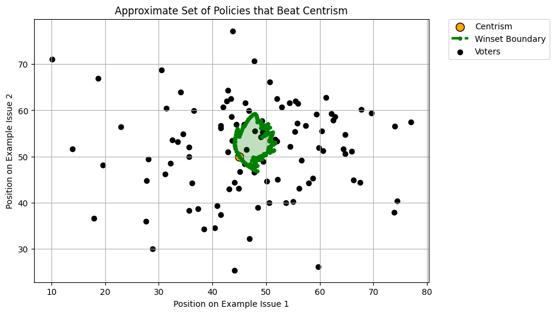
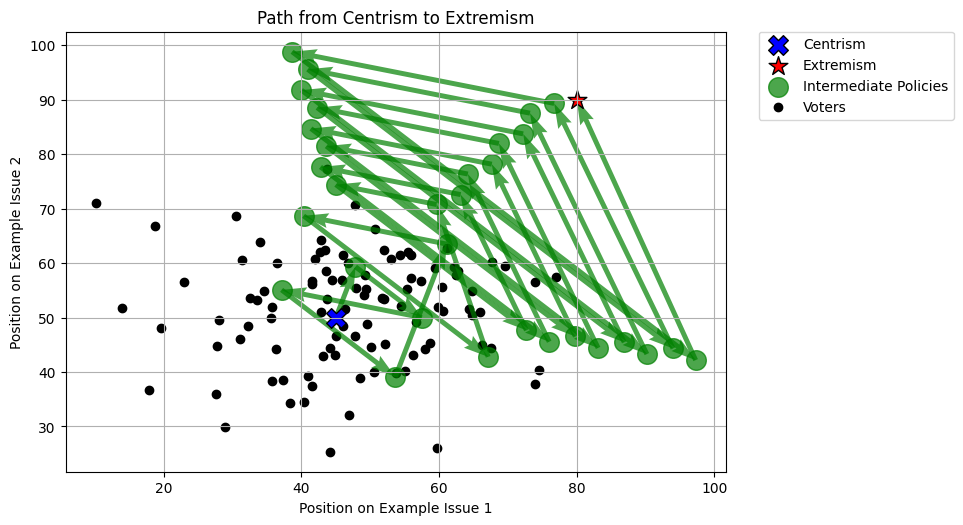

# McKelvey-Schofield Chaos Theorem & Other Electoral Dynamics Simulation

[](https://www.python.org/downloads/)
[](LICENSE)
[]()

## Project Overview

This repository demonstrates advanced electoral dynamics through computational simulations of the **McKelvey-Schofield Chaos Theorem** and **Ranked-choice Voting system**. The project showcases implementation of mathematical theory, data visualization, and complex algorithms in political science.

### What is the McKelvey-Schofield Chaos Theorem?

The [McKelvey-Schofield Chaos Theorem](https://en.wikipedia.org/wiki/McKelvey%E2%80%93Schofield_chaos_theorem) proves that in multidimensional policy spaces, an agenda setter can (under fairly general conditions on voter preferences) manipulate voters to choose any policy over any other through strategic sequencing of binary choices. This project provides interactive visualizations and computational tools to explore this fascinating result.

More information on the McKelvey-Schofield Chaos Theorem (and ranked-choice voting) can be found in the `docs` subfolder.

## Key Features

### Electoral Simulations
- **Two-party elections** with customizable voter distributions
- **Multi-party elections** with complex preference structures
- **Ranked-choice voting** with round-by-round analysis
- **Real-world data integration** using US electorate datasets

### Implementation of Mathematical Theory
- **Voter choice** in 2D Euclidean and Manhattan geometries
- **Winset computation** - finding the set of policies that can defeat a given incumbent
- **McKelvey-Schofield pathfinding** - strategic policy transition sequences for the agenda setter
- **Electoral strategy optimization** in a ranked-choice voting system

### Advanced Visualizations
- **Round-by-round animations** of individual voter distribution in ranked-choice elections
- **Sankey diagrams** for ranked-choice voting flows
- **Policy space heatmaps** to show the expected effects of introducing new policies
- **Path trajectory plots and animations** showing strategic policy transitions for an agenda setter

## Quick Start

See `QUICK_START.md` for more thorough directions.

### Prerequisites
- Python 3.8+
- FFmpeg (for animations)

### Installation

```bash
# Clone the repository
git clone https://github.com/nyfine99/mckelveyschofield.git
cd mckelveyschofield

# Install dependencies
pip install -r requirements.txt
```

### Basic Usage

```python
# Run a simple electoral simulation
python -m scripts.euclidean_electorate

# Generate multiple simulations with animations
python -m scripts.multirun_euclidean

# Explore ranked-choice voting
python -m scripts.small_rcv_electorate
```

## Project Structure

```
mckelveyschofield/
├── election_dynamics/     # Core electoral simulation engine
├── voters/               # Voter behavior models
├── policies/             # Policy representation
├── scripts/              # Ready-to-run examples
├── utility_functions/    # Mathematical and evaluation tools
├── docs/                 # Detailed documentation and sample outputs
├── data/                 # Sample datasets
└── output/               # Generated visualizations
```

## Technical Highlights

### Advanced Algorithms
- **Genetic algorithm optimization** to obtain highest-performing newcomer electoral strategy
- **Lookahead pathfinding** with configurable horizons
- **Efficient winset boundary computation** using an adapted binary search
- **Multi-dimensional policy space analysis**

### Performance Features
- **Vectorized computations** using NumPy
- **Memory-efficient data structures**

### Research Applications
- **Political science research** and electoral analysis
- **Game theory** and strategic behavior simulation
- **Data visualization** and computational social science
- **Educational demonstrations** of a complex theorem

## Documentation

- **[McKelvey-Schofield Guide](docs/mckelvey_schofield.md)** - deep dive into the theorem and implementations
- **[Ranked-Choice Voting](docs/ranked_choice_voting.md)** - RCV simulation capabilities
- **[Gallery](docs/gallery/)** - Visual examples and outputs

## Example Outputs

### Winset Visualization


### McKelvey-Schofield Path


### Ranked Choice Voting Flow


### New Policy Ranked Choice Voting Effects


## Development

### Running Tests
```bash
# Run example scripts to verify functionality
python -m scripts.euclidean_electorate
python -m scripts.small_rcv_electorate
```

### Contributing
Contributions are welcome!

## Ideas for Future Development

- McKelvey-Schofield pathfinding capabilities for voters with any weighted L1 or L2 norm utility functions
- Increased performance optimization for large-scale electorates
- (Documentation) A justification as to the validity of the winset boundary algorithm
- Exploration and possible implementation of non-greedy McKelvey-Schofield pathfinding
- Exploration of ranked-choice voting with limits on how many policies voters can put on their ballots, and finding the optimal location to insert a new policy

## Contact & Collaboration

Feel free to reach out for collaboration opportunities or questions about the implementation!

---

*Built with Python, NumPy, Matplotlib, and computational simulation techniques.*
