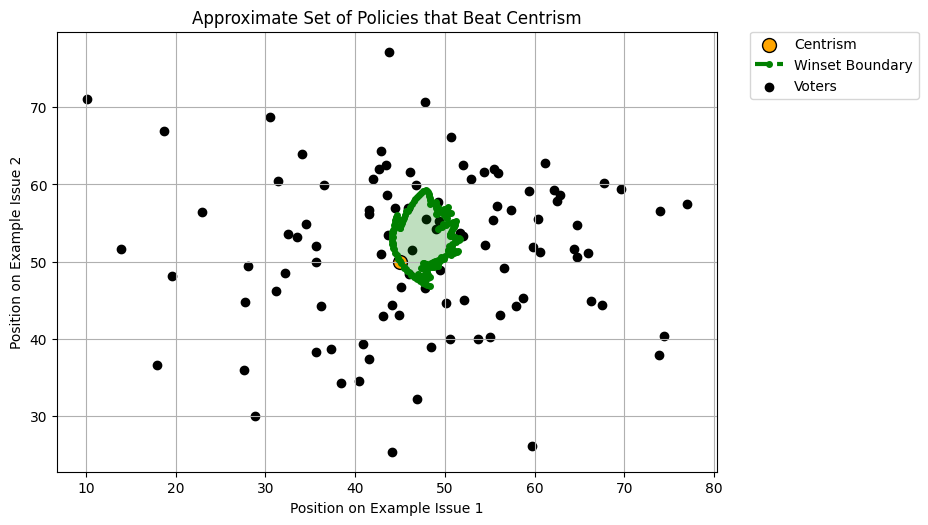

# McKelvey-Schofield Capabilities

This repository provides tools for exploring the McKelvey-Schofield chaos theorem, winsets, and policy pathfinding in two-dimensional policy spaces. We explore some of the capabilities offered here.

## Key Features

- **Winset Boundary Visualization:**  
  Compute and plot the set of policies that can defeat a given status quo under majority rule.

- **Greedy and Lookahead Path Algorithms:**  
  Simulate different agenda-setting strategies (greedy, lookahead, adjusted) for use in constructing a McKelvey-Schofield path.

- **McKelvey-Schofield Path Plotting and Animation:**  
  Animate or plot the sequence of policy changes as the agenda setter moves through the policy space, showing a path of binary options through which voters can be made to choose an undesirable policy over a desirable one.

## Example Visualizations

### Winset Boundary

*The shaded region shows the set of policies that can defeat the given status quo policy.*

### McKelvey-Schofield Path

*The green arrows show the path of policy changes from the status quo to the goal policy.* 

(Please note that the path is not always this orderly - using the greedy algorithm is more likely to produce an orderly path, but it is also more likely to fail at creating a path altogether.)

## Sample

The script `scripts/euclidean_electorate.py` provides example implementation of all of the features above.

---
