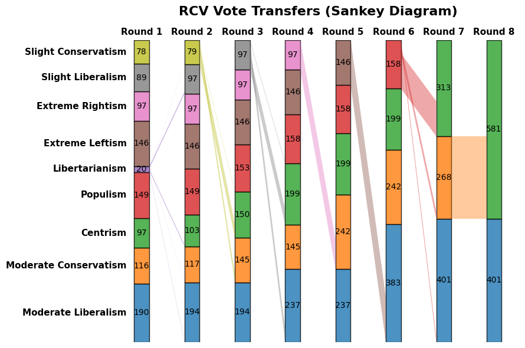
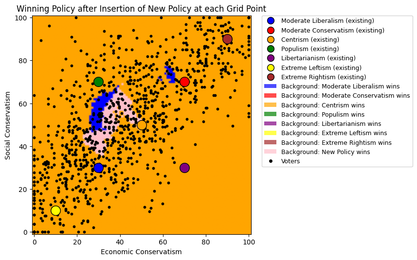

# Ranked-choice Voting (RCV) Visualizations

This module provides tools for simulating and visualizing RCV elections in multi-party settings. Note that candidate and policy are often used interchangeably throughout this module - "policy" by default, but "candidate" in circumstances where it makes more sense.

## Key Features

- **Sankey Diagrams:**  
  Visualize the flow of votes between candidates across rounds in RCV elections.

- **RCV Round Animation:**  
  Animate the rounds of an RCV election, showing how votes transfer and which candidates are eliminated.

- **Grid Search Policy Winmap:**  
  Visualize which policy would win if a new policy were inserted at any point in the policy space, given a list of previously-competing policies.

- **Genetic Search Best Policy:**  
  Run a genetic search to determine which new policy would perform best if inserted into the policy space, given a list of previously-competing policies.

## Example Visualizations

### Sankey Diagram

*A sankey diagram showing the flow of votes between candidates across RCV rounds.*

### Grid Search Policy Winmap

*Blue regions indicate where inserting a new policy would lead to a win for the blue policy under RCV, orange for orange, etc. Additionally, in the case above, the gray regions indicate where inserting a new policy would lead to a victory for that new policy itself. Black dots are voters; large circles are existing policies.*

## How to Use

The scripts `scripts/small_rcv_electorate.py` and `scripts/us_electorate_scripts/echelon_electorate_multiparty_winmaps` provide example implementation of all of the features above.

---
